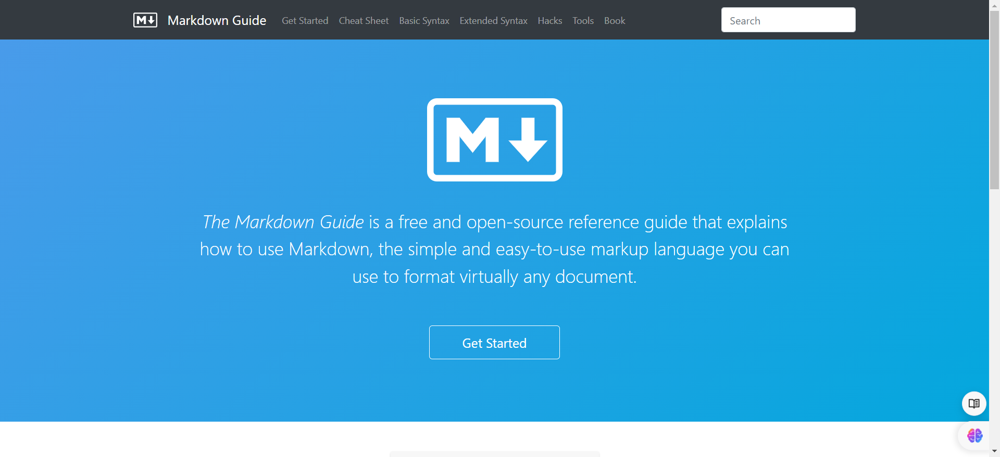
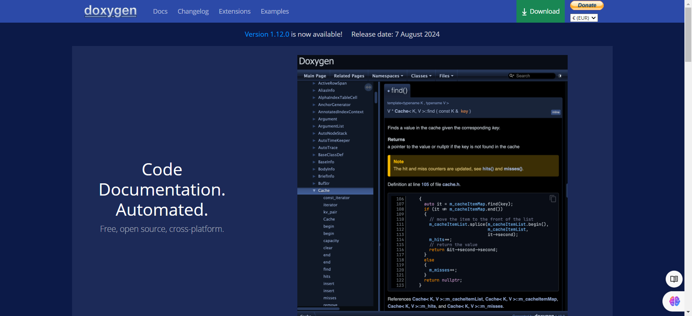
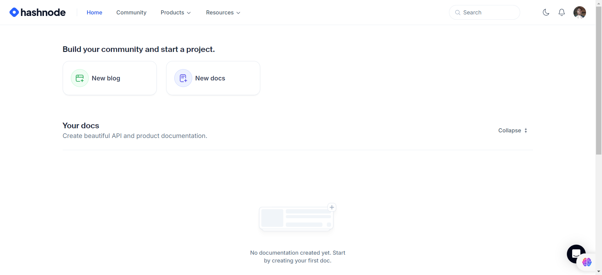

# 🖊️ Technical Writing 

Welcome to the **Technical Writing** resources section! This provides a guide to mastering the craft of communication. It is designed to support learners at every stage of learning from building foundational skills to advancing your expertise in creating clear, engaging and user-centered documentation.

## 📑 Table of Contents
1. [Beginners Level](#-beginners-level)
2. [Intermediate Level](#-intermediate-level)
3. [Advanced Level](#-advanced-level)
4. [Popular Tools](#-popular-tools)
5. [Additional Resources](#-additional-resources)
6. [Contributing](#-contributing)

---

## 🟢 Beginners Level

### 📝 What is Technical Writing?
Technical writing is the practice of creating documentation that explains complex information in a clear, concise, and user-friendly way. It’s essential for fields like software development, engineering, and healthcare, where clarity helps users understand complex systems and products.

**Why it’s important:** Good technical writing can improve user experience, reduce errors, and make products more accessible.

### Resources for Beginners

1. **[Introduction to Technical Writing (Google)](https://developers.google.com/tech-writing)** - A free course covering the basics of technical writing.
2. **[Technical Writing One (Google)](https://developers.google.com/tech-writing/one)** - Dive into grammar, style, and writing techniques for technical documentation.
3. **[Tech Writing Handbook (GitLab)](https://about.gitlab.com/handbook/engineering/technical-writing/)** - A practical guide for beginners working with technical documentation.
4. **[The Ultimate Guide to Technical Writing](https://www.hubspot.com/technical-writing-guide)** - Covers the basics and introduces best practices.
5. **[Coursera - Technical Writing](https://www.coursera.org/learn/technical-writing-introduction)** -  covers the basics of technical writing, including the writing process, document design, and peer review. 4 weeks
6. **[Git and Github](https://www.youtube.com/watch?v=RGOj5yH7evk)** -
covers the basic of git and github which is used in technical documentation. 2 hours

---

## 🟡 Intermediate Level

### 📄 Structuring and Formatting Documentation
At the intermediate level, you’ll learn how to structure content effectively, work with style guides, and understand common documentation formats like user guides, API documentation, and tutorials.

### Intermediate Resources
1. **[How to Write Documentation for APIs](https://idratherbewriting.com/learnapidoc/)** - A comprehensive guide to writing API documentation.
2. **[Technical Writing Style Guide (Microsoft)](https://docs.microsoft.com/en-us/style-guide/welcome/)** - Microsoft's style guide, covering structure, tone, and terminology.
3. **[Writing Software Documentation (Coursera)](https://www.coursera.org/learn/software-documentation)** - A practical course on structuring software documentation for different audiences.

---

## 🔴 Advanced Level

### Refining Your Skills and Going Deeper
Advanced technical writers focus on refining writing for clarity and precision, learning how to manage documentation projects, and mastering collaborative tools.

### Advanced Resources
1. **[Advanced Technical Writing Techniques](https://www.udemy.com/course/technical-writing-course/)** - Covers advanced writing techniques, project management, and working with engineers.
2. **[Documenting REST APIs (OpenAPI/Swagger)](https://idratherbewriting.com/learnapidoc/docapis_openapi.html)** - A guide to creating and maintaining API documentation with OpenAPI/Swagger.
3. **[Information Mapping](https://www.informationmapping.com/)** - A methodology for organizing and presenting complex information clearly.

---

## 🔧 Popular Tools

Different tools make technical writing and document management more efficient. Here are some of the most popular:

### **Markdown** (Documentation)

A lightweight language that makes formatting simple and widely compatible across platforms.

- **[Markdown Guide](https://www.markdownguide.org/)** - A comprehensive guide to using Markdown effectively.

### **Doxygen** (Code Documentation)

A tool to automatically generate documentation from annotated source code.

- **[Doxygen Official Docs](https://doxygen.nl/manual/index.html)** - Detailed instructions for using Doxygen in documentation.

### **Hashnode** 

A free blogging platform for documentation. 

- **[Hashnode](https://hashnode.com/)** -  platform designed for developers and tech enthusiasts to create technical contents.

---

## 🌍 Additional Resources

### 📚 Books
- **[The Elements of Technical Writing](https://www.amazon.com/Elements-Technical-Writing-Thomas-Pearsall/dp/0201599047)** - Covers foundational concepts in technical writing.
- **[Technical Writing for Dummies](https://www.amazon.com/Technical-Writing-Dummies-Sheryl-Lindsell-Roberts/dp/0764553089)** - A beginner-friendly guide to technical writing concepts.

### 📝 Blogs
- **[Write the Docs](https://www.writethedocs.org/)** - Community-driven content and guides for documentation best practices.
- **[I'd Rather Be Writing](https://idratherbewriting.com/)** - Insights and tutorials by Tom Johnson, a technical writing expert.

### 👥 Communities
- **[Write the Docs Slack Community](https://www.writethedocs.org/slack/)** - A collaborative space for discussing technical writing topics.
- **[Technical Writing Subreddit](https://www.reddit.com/r/technicalwriting/)** - Reddit discussions on tools, strategies, and career advice in technical writing.

---

## 🤝 Contributing
Want to add a resource? Contributions are welcome! Check the [CONTRIBUTING.md](../CONTRIBUTING.md) file for guidelines on adding resources to this repository.